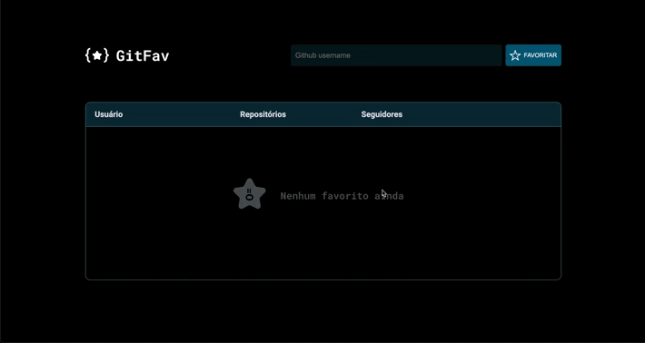

  <h1>GitFavorites</h1>

 

## About

The goal of this challenge was to practice object orientation in javascript, immutability, promises, responsive layout and manipulating tables in the DOM (Document Object Model).

 

  <h2>GIF</h2>
  

